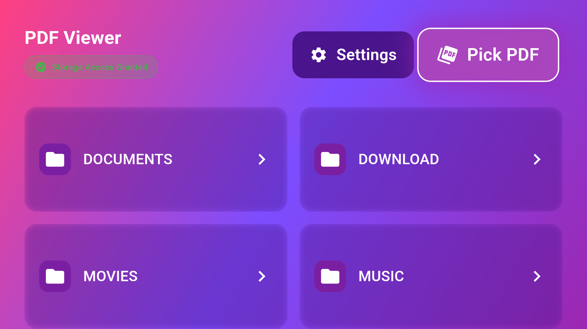
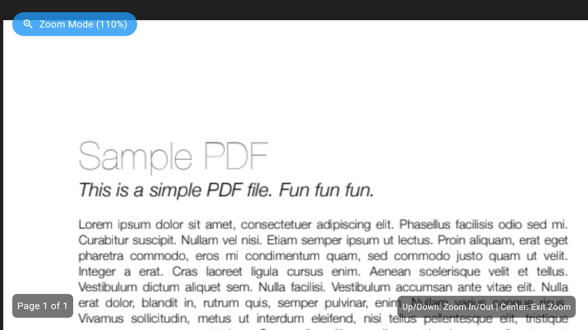

# Android TV PDF Viewer

The first and only open-source PDF viewer specifically designed for Android TV. Built with Flutter for optimal performance and user experience on large screens.

## 🌟 Why Android TV PDF Viewer?
- No existing PDF viewers specifically designed for Android TV
- Simple and intuitive navigation using TV remote
- Optimized for large screen viewing experience

## ✨ Features
- View PDFs seamlessly on Android TV devices.
- Optimized UI for TV navigation.
- Supports large PDF files with smooth performance.

## 📱 Screenshots
### Home Screen

*Navigate through your PDFs easily with remote control*

### Reading View

*Comfortable reading experience on your TV*

## 🚀 Quick Start
1. Download the latest APK from our [releases page](link_to_releases)
2. Install on your Android TV
3. Grant necessary permissions
4. Start viewing your PDFs!

## 🛠️ Technical Details
- Built with Flutter 3.2.0+
- Dart SDK 3.2.0+
- Optimized for Android TV navigation
- Minimal dependencies for better performance
- Supports various PDF formats

## 💻 Technologies Used

- **Flutter**: Core framework for cross-platform development
- **Dart**: Programming language optimized for building user interfaces
- **Android TV**: Platform-specific optimizations and navigation
- **Material Design**: UI components adapted for TV interfaces
- **PDF Processing**: Custom rendering and handling of PDF documents

## 🤝 Contributing
We welcome contributions! Here's how you can help:
- 🐛 Report bugs and issues
- 💡 Suggest new features
- 🔧 Submit pull requests
- 📖 Improve documentation

See [CONTRIBUTING.md](CONTRIBUTING.md) for detailed guidelines.

## 📋 Roadmap
- [ ] Unit, Widget and Integration Tests
- [ ] Custom themes support
- [ ] Network PDF loading
- [ ] Bookmarks feature
- [ ] Google Play Store release

## 📄 License
This project is licensed under the MIT License - see the [LICENSE](LICENSE) file for details.

## 🌟 Star Us!
If this project helps you, please consider giving it a star to show your support!

Keywords: Android TV PDF Reader, PDF Viewer for Android TV, Flutter, Open Source, TV App, PDF Reader, Large Screen PDF on TV

APK will only be installable on Android TV device - flutter build apk --release --target-platform android-arm64 --flavor tv